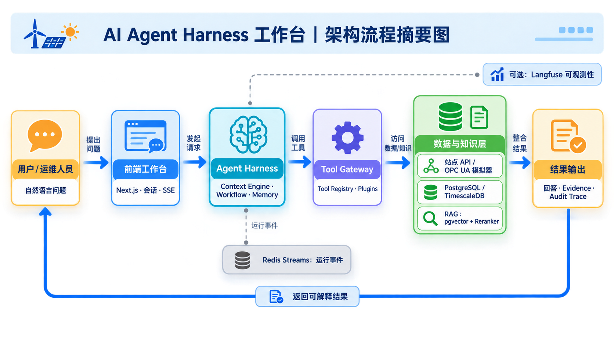

# wind-solar-ESS-Agent

<p align="center">
  
</p>

一个面向风、光、储工业场站的 AI Agent Harness 个人作品集项目。它负责接收 Agent 请求、编排上下文和工作流、调用工具、连接站点数据，并返回可追踪的回答与执行事件。

> **项目定位：** 本仓库用于个人技术展示、学习与本地演示，不是生产安全基线，也不应直接连接真实工业控制系统。公开部署前需要自行补齐企业级身份认证、TLS、网络隔离、持久化限流、密钥托管、监控审计和数据合规措施。

本发布版只支持两个真实 LLM Provider：

- DeepSeek
- 阿里云百炼

本服务不包含规则型 Mock Provider。启动时必须显式选择一个 Provider，并提供对应的 API Key。

## 你将得到什么

```text
客户端 / 工作台
        ↓
Agent API Gateway
        ↓
Agent Runtime · Context · Workflow · Memory
        ↓
Tool Registry · Station API · RAG
        ↓
PostgreSQL / Redis
        ↓
DeepSeek 或 百炼
```



默认 Compose 服务包括：

- `api-gateway`：Agent Runtime、HTTP API 和内部 gRPC Runtime；
- `postgres`：PostgreSQL 16、pgvector、zhparser；
- `redis`：Session、运行状态和 Redis Streams。

Runtime 事件流带有稳定递增的 `sequence`，调用方可通过 `after_sequence` 从指定位置恢复流式消费；模型摘要会发送 `assistant.started`、增量内容和终态事件。

本发布包包含后端 API 和可选的 Harness Control 前端工作台源码；本地 `.venv`、`site-packages`、`node_modules`、模型缓存、日志和真实密钥没有进入这个发布包。

架构摘要图和前端 3D 模型由项目作者制作。使用或再分发时请注明出处 `wind-solar-ESS-Agent — github.com/Neowalker69`，详见 [`ASSET-ATTRIBUTION.md`](ASSET-ATTRIBUTION.md)。第三方字体和 Draco 运行时声明见 [`THIRD_PARTY_NOTICES.md`](THIRD_PARTY_NOTICES.md)。

## Python Runtime 依赖

源码发布包只保留源代码、依赖声明和 `uv.lock`，不包含已经安装的 Python 库。也就是说，仓库中不会提交 `.venv/`、`site-packages/`、`node_modules/` 或其他依赖缓存；`uv.lock` 只是文本格式的版本锁定文件，不是打包后的依赖目录。

生产运行依赖的唯一正式声明位于 [`pyproject.toml`](pyproject.toml) 的 `[project].dependencies`。进入项目根目录后，可以使用与其对齐的 [`requirements.txt`](requirements.txt) 安装 Python Runtime 直接依赖：

```bash
python -m venv .venv
source .venv/bin/activate
pip install -r requirements.txt
```

如果使用 `uv`，请在项目根目录执行以下命令创建并激活虚拟环境：

```bash
uv venv
source .venv/bin/activate       # Linux / macOS / WSL
# PowerShell: .venv\Scripts\Activate.ps1
# Windows CMD: .venv\Scripts\activate.bat
```

激活环境后，可以使用普通 `pip` 安装，或直接使用 `uv pip` 安装：

```bash
pip install -r requirements.txt
# 等价写法：uv pip install -r requirements.txt
```

推荐使用 `uv sync` 管理完整项目环境，可以按锁定版本安装：

```bash
# 生产 API 运行环境，不安装测试和本地模型开发依赖
uv sync --frozen --no-dev

# 仅在本地开发、测试或部署本地 Embedding/Reranker 模型时使用
uv sync --frozen --dev
```

Docker 构建时会在镜像内部执行 `uv sync --frozen --no-dev`，因此运行容器所需的依赖会进入镜像，但不会进入 Git 源码仓库。开发依赖（例如测试工具、`sentence-transformers`、`transformers`）只在 `--dev` 环境中安装。

## CLI 模型配置与服务管理

项目提供一个轻量级 CLI，可在不使用 Docker Compose 时启动和管理本地 API Gateway：

```bash
uv sync --frozen --no-dev

# 前台运行，默认监听本机 127.0.0.1:8000
uv run --env-file .env python -m apps.api_gateway.daemon run \
  --host 127.0.0.1 --port 8000
```

常用服务管理命令：

```bash
uv run --env-file .env python -m apps.api_gateway.daemon start
uv run --env-file .env python -m apps.api_gateway.daemon status
uv run --env-file .env python -m apps.api_gateway.daemon stop
uv run --env-file .env python -m apps.api_gateway.daemon restart
```

CLI 当前不是完整的 Provider 配置向导，模型仍需先在 `.env` 中选择 Provider：

```env
# 二选一：deepseek 或 bailian
AGENT_HARNESS_MODEL_PROVIDER=bailian
AGENT_HARNESS_PROFILE=dev
```

### 百炼交互式输入

当 Provider 设为 `bailian` 且没有配置 `DASHSCOPE_API_KEY` 或 `DASHSCOPE_API_KEY_FILE` 时，前台运行或首次 `start` 会在终端隐藏输入 API Key，不会回显到屏幕：

```bash
uv run --env-file .env python -m apps.api_gateway.daemon run \
  --host 127.0.0.1 --port 8000
```

输入的百炼 Key 会保存到用户目录下的 `~/.agent-harness/config.json`，文件权限会设置为仅当前用户可读写（`0600`）。该配置文件不在项目目录中，但仍建议优先使用环境变量、`DASHSCOPE_API_KEY_FILE` 或 Docker Secrets。

### DeepSeek 和非交互式启动

DeepSeek 当前没有终端交互式输入流程，请在 `.env` 中配置：

```env
AGENT_HARNESS_MODEL_PROVIDER=deepseek
DEEPSEEK_API_KEY=<your-deepseek-api-key>
DEEPSEEK_MODEL=deepseek-v4-flash
```

如果已经通过 `.env`、环境变量或密钥文件配置好 API Key，可以使用 `--no-model-prompt` 明确跳过任何终端输入：

```bash
uv run --env-file .env python -m apps.api_gateway.daemon run \
  --host 127.0.0.1 --port 8000 --no-model-prompt
```

CLI 模式只适合本地开发和演示。不要把 API Key 作为命令行参数传入，也不要把 `~/.agent-harness/config.json`、`.env` 或其内容提交到 Git。

## 前端依赖

Harness Control 当前验证基线为 Node.js 22、Next.js 15.5.20 和 React 19.1.0，具体版本以 `apps/harness-control/package.json` 和 `package-lock.json` 为准。无需全局安装 Next.js，进入前端目录后执行：

```bash
cd apps/harness-control
npm install
```

安装完成后可启动本地开发服务：

```bash
npm run dev
```

使用 Docker 部署时无需在宿主机手动安装前端依赖，镜像构建过程会自动根据锁文件安装当前已验证版本。

## 快速开始

### 1. 准备环境

需要：

- Docker Engine；
- Docker Compose v2；
- DeepSeek 或百炼 API Key；
- `openssl`，用于生成本地运行密钥。

### 2. 下载并进入目录

```bash
git clone https://github.com/Neowalker69/wind-solar-ESS-Agent.git
cd wind-solar-ESS-Agent
```

仓库尚未正式发布时，上述地址用于表示计划发布位置；发布后以 GitHub 页面显示的实际 Clone 地址为准。

### 3. 创建本地配置

```bash
cp .env.example .env
```

打开 `.env`，二选一配置模型 Provider。

DeepSeek：

```env
AGENT_HARNESS_MODEL_PROVIDER=deepseek
DEEPSEEK_API_KEY=<your-deepseek-api-key>
DEEPSEEK_MODEL=deepseek-v4-flash
```

百炼：

```env
AGENT_HARNESS_MODEL_PROVIDER=bailian
DASHSCOPE_API_KEY=<your-bailian-api-key>
BAILIAN_MODEL=qwen3.7-plus
```

再为本地服务生成三个独立密钥：

```bash
openssl rand -hex 32
openssl rand -hex 32
openssl rand -hex 32
```

分别填入：

```env
HARNESS_DB_PASSWORD=<database-password>
CONTROL_RUNTIME_SHARED_SECRET=<runtime-secret>
TOOL_GATEWAY_JWT_SECRET=<jwt-secret>
```

如果要启动 Harness Control 前端，还需要生成一个独立的 `JWT_SECRET`：

```bash
openssl rand -hex 32
```

将结果填入：

```env
JWT_SECRET=<control-jwt-secret>
```

本地作品演示账号默认为 `admin / admin123`，对应配置为：

```env
CONTROL_PANEL_USERNAME=admin
CONTROL_PANEL_PASSWORD=admin123
```

这是便于体验的公开演示密码。若 Control 将监听局域网或公网地址，必须先在 `.env` 中改成高强度密码。

默认 Compose 将 API 和 Control 端口绑定到 `127.0.0.1`，因此 `admin123` 只用于本机演示。不要为了远程访问直接把绑定地址改成 `0.0.0.0`；需要远程访问时，请先更换密码，并通过带 TLS、认证和限流的反向代理接入。

### 4. 启动服务

```bash
docker compose config
docker compose up -d --build
docker compose ps
```

看到 `api-gateway`、`postgres` 和 `redis` 处于运行状态后，检查健康接口：

```bash
curl http://127.0.0.1:8000/api/v1/gateway/health
```

API 文档地址：<http://127.0.0.1:8000/docs>

至此服务已经启动。模型调用会使用你在 `.env` 中选择的 DeepSeek 或百炼 Provider。

如果还要启动前端工作台，请执行：

```bash
docker compose --profile frontend up -d --build harness-control
```

浏览器访问 <http://127.0.0.1:3000>。前端通过 `api-gateway:50051` 连接 Agent Runtime；生产部署时，还需要将站点 API、身份认证和前端路由接入你的反向代理。本发布包不包含原项目的 Station API 服务。

## 常用操作

查看 API Gateway 日志：

```bash
docker compose logs -f api-gateway
```

停止服务并保留数据库数据：

```bash
docker compose down
```

停止服务并删除本地数据库卷：

```bash
docker compose down -v
```

切换 Provider：编辑 `.env` 中的 Provider 和对应 API Key，然后执行：

```bash
docker compose up -d --force-recreate api-gateway
```

## Provider 配置

### DeepSeek

```env
AGENT_HARNESS_MODEL_PROVIDER=deepseek
DEEPSEEK_API_KEY=<your-deepseek-api-key>
DEEPSEEK_BASE_URL=https://api.deepseek.com
DEEPSEEK_MODEL=deepseek-v4-flash
DEEPSEEK_THINKING=disabled
```

### 阿里云百炼

```env
AGENT_HARNESS_MODEL_PROVIDER=bailian
DASHSCOPE_API_KEY=<your-bailian-api-key>
BAILIAN_BASE_URL=https://dashscope.aliyuncs.com/compatible-mode/v1
BAILIAN_MODEL=qwen3.7-plus
```

Provider、模型名称和兼容 API 地址都可以通过环境变量调整。服务不会在两个 Provider 之间自动回退；配置错误会在容器启动时直接报错，避免请求被静默发送到错误模型。

如果使用 Docker Secrets 或挂载的密钥文件，可以使用 `_FILE` 变量，例如：

```env
DEEPSEEK_API_KEY_FILE=/run/secrets/deepseek_api_key
```

### 遥测时效参数

普通遥测和 SOH 可以使用不同的新鲜度阈值：

```env
AGENT_HARNESS_TELEMETRY_TTL_SECONDS=30
AGENT_HARNESS_TELEMETRY_SOH_TTL_SECONDS=604800
```

SOH 默认允许 7 天内的数据作为有效读数；其他遥测默认使用 30 秒阈值。模型汇总会按指标分别标记过期状态，不会因为一个指标过期就把整组遥测都判定为无效。

### RAG（可选）

发布包内置 20 份示例知识文档，但不包含任何 Embedding/Reranker 权重、缓存或模型文件。模型文件请按需下载到本地 `models/` 目录；该目录已被 Git 和 Docker 忽略，不会进入源码仓库或 API 镜像。

这些知识文档、图表、人员、场站、设备、工单、故障和技术参数全部是合成演示数据，不对应任何真实企业、设备厂商或工业设施，也不能作为真实运维或安全操作依据。目录级声明见 [`rag_dataset_20docs/README.md`](rag_dataset_20docs/README.md)。

推荐模型与目录：

| 用途 | ModelScope 模型 | 本地目录 |
| --- | --- | --- |
| Embedding | `Qwen/Qwen3-Embedding-0.6B` | `models/embedding/Qwen3-Embedding-0.6B` |
| Reranker | `AI-ModelScope/bge-reranker-v2-m3` | `models/reranker/bge-reranker-v2-m3` |

安装 ModelScope 后自行下载：

```bash
pip install modelscope
modelscope download --model Qwen/Qwen3-Embedding-0.6B --local_dir ./models/embedding/Qwen3-Embedding-0.6B
modelscope download --model AI-ModelScope/bge-reranker-v2-m3 --local_dir ./models/reranker/bge-reranker-v2-m3
```

详细参数请参考 [ModelScope 模型下载说明](https://modelscope.cn/docs/models/download)。如果只使用百炼 Embedding，可以不下载 Embedding 权重；如果要启用本地 Embedding 适配器，请先执行 `uv sync --frozen --dev`，并将 `RAG_EMBEDDING_PROVIDER` 设为 `local`、`RAG_EMBEDDING_MODEL` 设为上面的本地目录。

本发布包保留了 Reranker 的按需部署脚本 `Dockerfile.reranker-model-init` 和 `apps/reranker_model_init.py`。它们会把模型下载到被 Git 忽略的 `models/reranker/`，不会把权重写入代码仓库。需要本地 Reranker 时，在 `.env` 中打开 RAG：

```env
AGENT_HARNESS_RAG_ENABLED=true
AGENT_HARNESS_RAG_RERANKER_ENABLED=true
RAG_RERANKER_BASE_URL=http://harness-reranker:80
```

然后执行：

```bash
docker compose --profile rag-local up -d --build harness-reranker
```

`rag-local` profile 会先运行 ModelScope 下载容器，再启动 Hugging Face TEI Reranker；首次启动需要下载模型，且需要本机具备可用的 Docker 运行环境。需要 GPU 时，可根据 TEI 镜像和主机环境补充 Docker GPU 配置。

## 可选 Worker

需要异步反思 Worker 时：

```bash
docker compose --profile workers up -d
```

需要 Tool Gateway 时：

```bash
docker compose --profile tool-gateway up -d
```

## 常见问题

- `model_provider_api_key_missing:deepseek`：检查 `DEEPSEEK_API_KEY` 或 `DEEPSEEK_API_KEY_FILE`。
- `model_provider_api_key_missing:bailian`：检查 `DASHSCOPE_API_KEY` 或 `DASHSCOPE_API_KEY_FILE`。
- `model_provider_unsupported:mock`：此发布版不包含 Mock Provider，请改用 `deepseek` 或 `bailian`。
- 端口冲突：在 `.env` 设置 `AGENT_HARNESS_PORT=18000`，然后重新创建 `api-gateway`。
- 模型请求失败：检查模型名称、API Key、Base URL、容器网络和模型账户权限。

## 安全注意事项

- Provider 密钥使用 `DEEPSEEK_API_KEY` 或 `DASHSCOPE_API_KEY`；可选 Embedding 密钥使用 `RAG_EMBEDDING_API_KEY`；外部场站令牌使用 `STATION_API_TOKEN`；
- Control 登录密码、数据库密码、服务间共享密钥和 JWT 签名密钥均只填写在本地 `.env`，其中 `admin123` 仅用于本地作品演示；
- 默认端口仅绑定 `127.0.0.1`；不要把本项目当前认证设计视为公网或生产安全方案；
- 不要提交 `.env`、API Key、数据库密码或生产日志；
- 不要把真实密钥写入 Dockerfile、README、镜像层或前端代码；
- 生产环境优先使用 Docker Secrets、云 Secret Manager 或其他密钥托管系统；
- 对外暴露服务前，请补齐 TLS、身份认证、访问控制、限流和审计策略；
- 未完成数据合规评估前，不要把真实工业数据发送给外部模型服务。

## 构建和发布镜像

```bash
docker build -t agent-harness-llm-providers:0.1.0 .
docker build -f apps/harness-control/Dockerfile -t agent-harness-control:0.1.0 .
docker login ghcr.io
docker tag agent-harness-llm-providers:0.1.0 ghcr.io/neowalker69/wind-solar-ess-agent-api:0.1.0
docker push ghcr.io/neowalker69/wind-solar-ess-agent-api:0.1.0
docker tag agent-harness-control:0.1.0 ghcr.io/neowalker69/wind-solar-ess-agent-control:0.1.0
docker push ghcr.io/neowalker69/wind-solar-ess-agent-control:0.1.0
```

发布前请确认服务能够正常启动，并确保镜像中不包含任何真实 API Key。

## 本地验证

```bash
# 测试需要开发依赖；生产镜像只使用 uv sync --frozen --no-dev
uv sync --frozen --dev
uv run pytest -q tests/test_model_provider_config.py
docker compose config
docker build -t agent-harness-llm-providers:local .
cd apps/harness-control
npm install
npm test -- --runInBand
npm run typecheck
npm run build
```

## 许可证

本项目源代码采用 [MIT License](LICENSE)，版权归 `github.com/Neowalker69`。原创视觉资产的署名要求见 [`ASSET-ATTRIBUTION.md`](ASSET-ATTRIBUTION.md)，第三方运行时资产声明见 [`THIRD_PARTY_NOTICES.md`](THIRD_PARTY_NOTICES.md)。

欢迎通过 Issue 报告问题或提出建议；提交 Pull Request 前请阅读 [`CONTRIBUTING.md`](CONTRIBUTING.md)。
