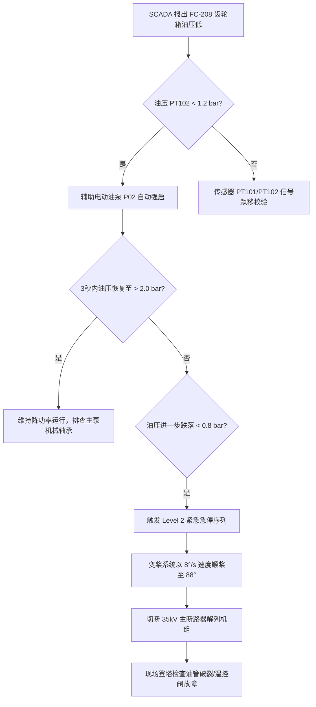

# WTG-8000D 齿轮箱润滑油压异常急停与应急响应处置 Playbook (PLB-W102)

> **文档属性与适用范围**：
> - **文档编号**：PLB-W102-2026
> - **版本号**：v1.0
> - **适用机型**：WTG-8000D 8.0MW 双馈风力发电机组
> - **关联故障码**：`FC-208` (Gearbox Lubrication Oil Pressure Low)

---

## 1. 触发条件与多级报警矩阵

WTG-8000D 齿轮箱采用主机械泵 + 辅电动油泵双冗余供油系统，主管道配置双冗余压力传感器 `PT101`（主泵出口）与 `PT102`（滤清器后）。

| 油压状态级别 | 管道压力范围 (bar) | 系统自动响应动作 | 运维人员响应要求 |
| :--- | :--- | :--- | :--- |
| **正常运行 (Normal)** | $2.5	ext{–}3.5	ext{ bar}$ | 主泵/辅泵按温控逻辑平稳运行 | SCADA 实时监控 |
| **一级预警 (Level 1 Alarm)** | **$< 1.2	ext{ bar}$** | 1. 触发 SCADA `FC-208-A` 预警 2. 强行启动辅助电动油泵 `P02` | 10分钟内远程核查 `PT101`/`PT102` 读数与油温 |
| **二级紧急跳闸 (Level 2 Trip)** | **$< 0.8	ext{ bar}$** (持续 $>3	ext{s}$) | 1. **PLC 发起紧急顺桨急停 (Emergency Pitch)** 2. **3秒内切断主断路器解列** 3. 锁定机组禁止自动复位 | 1. 立即派员赴现场 2. 登塔排查油路泄漏与泵组卡死 |

---

## 2. 应急处置决策树 (Mermaid Flowchart)

---

## 3. 现场处置与复位检查清单 (Restart Checklist)

在解除 `FC-208` 锁定并重新启动机组前，运维人员必须完成以下所有复核项：

1. **机械泄露检查**：检查齿轮箱下部油底壳、温控旁路阀及冷凝器管路无漏油。
2. **滤清器压差校验**：检查滤清器压差开关 `DPS01` 读数（需 $< 1.8	ext{ bar}$，若 $> 1.8	ext{ bar}$ 须更换滤芯）。
3. **辅泵手动测试**：在控制柜手动启动电动辅泵 `P02`，测量 `PT102` 读数应升至 $2.5	ext{–}3.0	ext{ bar}$。
4. **变桨储能复核**：确认三叶片变桨后备超级电容组电压满足现行技术规范（满足 $\ge 195	ext{ VDC}$）。
