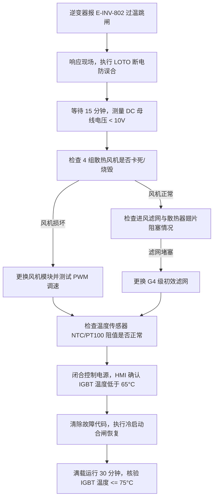

# SOP-S101: PV2000-K 集中式光伏逆变器高温过热保护与运维恢复标准作业程序

| 文档编号 | SOP-S101 | 生效日期 | 2026-05-15 |
| :--- | :--- | :--- | :--- |
| **版本号** | v2.1 | **密级分类** | 内部公开 / 运维技术规范 |
| **适用设备** | PV2000-K 集中式逆变器 (2000kW / 1500V) | **编写部门** | 光伏电站运维技术部 |
| **审核人** | 张伟 (高级运维专家) | **批准人** | 刘建国 (运维总工程师) |

---

## 1. 目的与适用范围

本标准作业程序（SOP）规定了 `PV2000-K` 集中式光伏逆变器在夏季高温、高负荷运行环境下的过热保护触发逻辑、降额运行控制、过温跳闸应急处置以及风机与滤网维护作业标准。

本程序适用于云川光伏电站及相关集中式光伏电站内所有 `PV2000-K` 2000kW 集中式光伏逆变器的日常巡检、高温预警处置与故障恢复。

---

## 2. 规范性引用文件

* **GB/T 37408-2019** 《光伏发电并网逆变器技术要求》
* **IEC 62109-1/2** 《光伏电力系统用功率转换器的安全性》
* **DL/T 596** 《电力设备预防性试验规程》
* **MAN-S102** 《PV2000-K 集中式光伏逆变器技术手册与Modbus寄存器映射指南》

---

## 3. 过热保护控制逻辑与参数阈值

`PV2000-K` 逆变器配备三级过热防护与自适应功率调节系统，基于环境温度传感器（NTC）与 IGBT 模块内置嵌入式 PT100 传感器实施动态监控。

### 3.1 关键温度阈值与控制响应表

| 监控指标 | 触发条件 | 控制响应与系统动作 | 报警/状态码 | 恢复条件 |
| :--- | :--- | :--- | :--- | :--- |
| **环境温度高** | 舱内/环境温度 $> 45^\circ	ext{C}$ | 启动强制风冷系统 100% 全速运行；发送预警信号至 SCADA | `W-INV-301` | 环境温度 $< 40^\circ	ext{C}$ 恢复正常风速控制 |
| **IGBT 预警** | $80^\circ	ext{C} < T_{IGBT} \le 85^\circ	ext{C}$ | SCADA 系统记录预警；维持全功率输出并监测温升速率 $dT/dt$ | `W-INV-302` | $T_{IGBT} \le 78^\circ	ext{C}$ 消除预警 |
| **一阶降额** | $85^\circ	ext{C} < T_{IGBT} \le 90^\circ	ext{C}$ | 触发 MPPT 功率自适应降额，**限制最大输出功率为额定功率的 80%** (1600kW) | `A-INV-401` | $T_{IGBT} \le 80^\circ	ext{C}$ 持续 10 min 后解除降额 |
| **二阶降额** | $90^\circ	ext{C} < T_{IGBT} \le 95^\circ	ext{C}$ | 线性降低输出功率，最低降至额定功率的 50% (1000kW) | `A-INV-402` | $T_{IGBT} \le 82^\circ	ext{C}$ 持续 10 min 后解除降额 |
| **紧急跳闸** | $T_{IGBT} > 95^\circ	ext{C}$ 或 $dT/dt > 3^\circ	ext{C}/	ext{min}$ | **触发过温保护紧急跳闸**，断开 AC 接触器与 DC 开关，封锁 IGBT 驱动脉冲 | `E-INV-802` | 需人工现场排查并手动复位，且 $T_{IGBT} < 65^\circ	ext{C}$ |

---

## 4. 安全防护与作业前准备 (LOTO)

在执行逆变器风机检修、散热器清洗或滤网更换前，必须严格执行上锁挂牌（LOTO）程序。

### 4.1 安全防护要求
1. **绝缘防护**：佩戴 1000V 防护等级绝缘手套、穿绝缘鞋、佩戴护目镜。
2. **残余电荷释放**：断开 DC/AC 开关后，必须**等待至少 15 分钟**，并使用万用表测量 DC 母线电压小于 **10V DC** 后方可开门作业。
3. **环境安全**：若舱内温度超过 $50^\circ	ext{C}$，须开启防爆排风扇通风 15 分钟降温后方可进入。

---

## 5. 散热系统维护作业步骤 (SOP Step-by-Step)

### 步骤 1：风机运行状态与 PWM 调速检查
1. 登录 SCADA 或本地 HMI 界面，查验 4 组风机（Fan #1 - #4）转速反馈（正常额定转速：2800 RPM）。
2. 若风机转速低于 2000 RPM 或报出 `W-INV-305` 风机异常信号，使用钳形表测量风机供电电压（正常：380V AC三相，或 24V DC 控制信号）。

### 步骤 2：防尘滤网拆卸与更换
1. 使用专用钥匙打开逆变器进风口外罩格栅。
2. 取出高密初效合成纤维滤网（规格：G4 级，防尘效率 $>90\%$）。
3. **判定标准**：若滤网表面积尘严重、压差计显示进风压差 $\Delta P > 250	ext{ Pa}$，必须直接更换全新滤网；若压差在 $100	ext{–}200	ext{ Pa}$ 之间，可用 $0.4	ext{–}0.6	ext{ MPa}$ 干燥压缩空气由内向外吹扫。

### 步骤 3：IGBT 散热器翅片清洗
1. 使用工业级防静电吸尘器清除散热器底座及翅片表面的浮灰。
2. 对顽固油污或结块灰尘，采用无腐蚀性精密电子清洗剂喷涂，严禁使用高压水枪直接冲洗逆变器功率柜内部。

---

## 6. 故障跳闸恢复流程

---

## 7. 现场维护签认表

| 维护项目 | 检查标准 / 测量值 | 结果判定 | 运维员签字 | 日期 |
| :--- | :--- | :--- | :--- | :--- |
| **DC 母线残压** | $< 10	ext{ V DC}$ | [ ] 合格 [ ] 不合格 | | 2026-08-14 |
| **进风滤网压差** | $\le 150	ext{ Pa}$ | [ ] 合格 [ ] 不合格 | | 2026-08-14 |
| **风机转速 (4组)** | $2800 \pm 100	ext{ RPM}$ | [ ] 合格 [ ] 不合格 | | 2026-08-14 |
| **满载 IGBT 温度** | $\le 78^\circ	ext{C}$ (在 $40^\circ	ext{C}$ 环温下) | [ ] 合格 [ ] 不合格 | | 2026-08-14 |