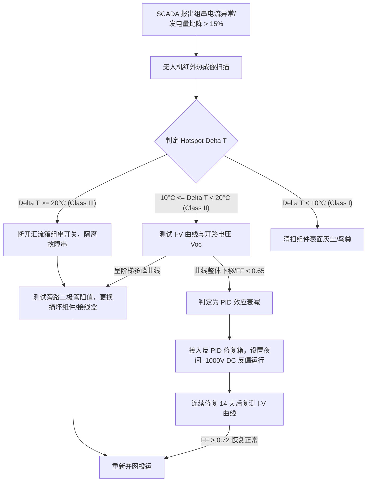

# PLB-S103: 光伏组串热斑效应与 PID 衰减诊断处置应急预案 (Playbook)

| 文档编号 | PLB-S103 | 生效日期 | 2026-06-01 |
| :--- | :--- | :--- | :--- |
| **适用对象** | 集中式/组串式光伏组件阵列 | **严重等级** | 2级 (性能衰减与火灾隐患) |
| **编制部门** | 光伏电站质量与运维组 | **技术支持** | 光伏组件制造厂与测试中心 |

---

## 1. 现象描述与诊断依据

光伏组串热斑效应（Hotspot Effect）与电位诱导衰减（Potential Induced Degradation, PID）是影响光伏电站发电量与系统安全的最主要隐患。

### 1.1 现象对比与识别特征

| 隐患类型 | 产生机制 | 现场识别手段 | 对发电量的影响 | 安全危害 |
| :--- | :--- | :--- | :--- | :--- |
| **热斑效应 (Hotspot)** | 电池片受遮挡、隐裂或二极管损坏，由发电源转为负载消耗功率并剧烈发热 | 红外热成像仪（无人机/手持式）、组件接线盒焦灼痕迹 | 局部功率下降 10%–100%，触发组串 bypass | 极高，严重时可导致背板烧穿甚至引燃组串 |
| **PID 衰减** | 电池片与接地边框间高负偏压（高达 -1000V），导致钠离子迁移引发表面钝化层失效 | I-V 曲线测试仪（填充因子 FF 显著下降）、SCADA 组串电流对比 | 整串发电量衰减 20%–60%，呈现负极端组件逐块加重特征 | 中等，主要为大幅发电量损失 |

---

## 2. 红外热成像温升分级与处置策略 (Hotspot Delta T Rules)

红外检测应在辐照度 $> 700	ext{ W/m}^2$、风速 $< 4	ext{ m/s}$ 的晴朗无云天气下进行，热发射率设定为 $arepsilon = 0.95$。

$$\Delta T = T_{hotspot} - T_{normal\_cell}$$

| 热斑等级 | 温升范围 ($\Delta T$) | 故障诊断判定 | 强制处置动作 | 响应时限 |
| :--- | :--- | :--- | :--- | :--- |
| **Class I (轻微)** | $5^\circ	ext{C} \le \Delta T < 10^\circ	ext{C}$ | 表面鸟粪、灰尘积聚或轻微杂物遮挡 | 安排无人机高压清洗或人工擦拭组件表面 | 48 小时内 |
| **Class II (中度)** | $10^\circ	ext{C} \le \Delta T < 20^\circ	ext{C}$ | 内部电池片隐裂、虚焊或部分旁路二极管性能失效 | 使用便携式 I-V 曲线测试仪定位受损组件；隔离问题组件 | 24 小时内 |
| **Class III (严重)** | $\Delta T \ge 20^\circ	ext{C}$ | 旁路二极管击穿短路、背板变色毁损或电池片严重碎裂 | **立即断开汇流箱组串开关，隔离该组串**；更换损坏组件 | **4 小时内（紧急）** |

---

## 3. I-V 曲线多峰特性诊断逻辑

使用便携式 I-V 测量仪对疑似组串进行扫描，诊断典型曲线异常形态：

```text
[正常组串 I-V 曲线]          [热斑/遮挡多峰 I-V 曲线]
  I (A)                      I (A)
  ^                          ^
  |--------------\           |------\  (阶梯1)
  |               \          |       \-----\  (阶梯2: 旁路二极管导通)
  |                \         |                +------------------> V     +-----------------> V
```

1. **阶梯型多峰曲线**：表明组串内存在部分组件被遮挡或严重热斑，旁路二极管导通分流。
2. **斜率过大/填充因子 (FF) < 0.65**：表明存在严重的 PID 衰减或串联电阻过大（线缆接头接触不良）。

---

## 4. 反 PID 修复装置 (Anti-PID Box) 安装与夜间偏置配置

针对高湿高热地区发生 PID 衰减的组串，采用**夜间反向高压修复技术**。

### 4.1 反 PID 装置工作原理
在夜间无光照（光伏阵列 $V_{oc} < 50	ext{ V}$）时，反 PID 智能修复箱自动切入，在光伏组串负极与大地之间施加一个 **-1000V DC 负偏压**（极性与白天运行偏压相反），引导迁移至 PV-EVA 涂层中的 $	ext{Na}^+$ 离子反向迁移回玻璃基底，恢复 PN 结表面钝化效果。

### 4.2 反 PID 修复箱关键参数设置表

| 参数名称 | 设定标准值 | 说明与注意事项 |
| :--- | :--- | :--- |
| **夜间反偏触发光照** | $< 20	ext{ W/m}^2$ | 避免白天阳光照下施加反向高压 |
| **修复输出直流电压** | -1000 V DC | 必须根据组串最大系统电压调整（最高 1500V） |
| **最大限制修复电流** | $< 5	ext{ mA}$ | 超过 10mA 触发漏电保护中断 |
| **夜间持续修复时长** | 6 - 8 小时 | 连续运行 14–30 天为一个修复周期 |
| **对地绝缘检测门限** | $> 10	ext{ M}\Omega$ | 每次高压输出前自检，绝缘过低禁止施压 |

---

## 5. 组串热斑与 PID 诊断处置流程树

