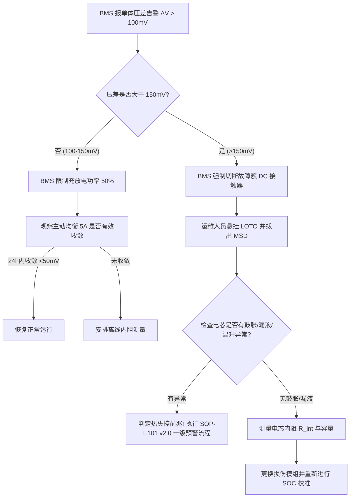

# 储能系统电池单体压差异常与容量衰减诊断 Playbook
**文档编号**: PLB-E103-2025
**主题**: BESS 单体压差异常 ($\Delta V > 150	ext{ mV}$) 与容量衰减诊断处置指南
**适用范围**: 储能电站 BMS 运维、电芯均衡与隔离维护

---

## 1. 现象判定与触发条件

当 SCADA 或 BMS 系统报出电池簇“压差过大告警”或“容量加速衰减”时，依据下表分类处理：

| 告警等级 | 压差指标 ($\Delta V$) | 判定与系统动作 | 处置优先级 |
| :--- | :--- | :--- | :--- |
| **轻微偏离** | $50	ext{ mV} < \Delta V \le 100	ext{ mV}$ | BMS 启动主动均衡逻辑 | P3 (例行维护关注) |
| **二级预警** | $100	ext{ mV} < \Delta V \le 150	ext{ mV}$ | BMS 限制充放电功率 50% | P2 (24小时内处理) |
| **三级严重故障** | **$\Delta V > 150	ext{ mV}$** | **BMS 强制切断故障簇，禁止充放电** | **P1 (立即现场排查)** |

---

## 2. BMS 主动均衡逻辑与配置

1. **均衡原理**: 采用电感式双向主动均衡技术，最大均衡电流为 **5 A**。
2. **触发门槛**: 当簇内最高单体与最低单体压差大于 $50	ext{ mV}$ 且 SOC 处于 40%–90% 平台区时启动。
3. **校准要求**: 若主动均衡持续运行 12 小时后 $\Delta V$ 仍未收敛至 $50	ext{ mV}$ 以内，说明电芯存在物理损伤或内阻突变，必须人工干预。

---

## 3. 故障电芯排查与隔离操作四步法

### 第一步：SCADA 数据提取与遥测核对
- 调阅 BMS 历史曲线，找出 $\Delta V > 150	ext{ mV}$ 发生的时段（充电末端或放电末端）。
- 确认故障电芯编号（如：Rack #03, Module #02, Cell #14）。

### 第二步：内阻与容量线下测试
- 停运故障电池簇，开断 DC 簇断路器，拔出手动维护开关 (MSD)，悬挂 LOTO 锁具。
- 使用交流内阻测试仪测量故障电芯内阻 $R_{int}$。若 $R_{int}$ 较同批次均值偏大 $30\%$ 以上，判定为电芯老化损伤。

### 第三步：物理隔离与模组更换
- 若确认电芯损坏，严格按规范拆卸模组采样线与巴线 (Busbar)。
- 更换同容量、同内阻档位的备用模组，拧紧螺栓至指定扭矩 ($9	ext{ Nm}$)。

### 第四步：复位与 SOC 重校准
- 重新插回 MSD，合上 DC 断路器，发起 BMS 全簇静置 SOC 重新校准。

---

## 4. 压差排查与热失控预防决策树 (Mermaid)

