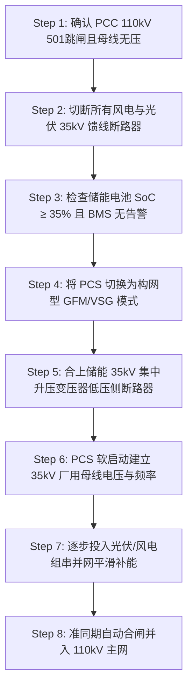

# SOP-G101: 110kV 并网点防孤岛保护与黑启动/构网型（GFM）切换控制 SOP

| 属性 | 内容 |
| :--- | :--- |
| **文档编号** | SOP-G101-2026 |
| **版本号** | v2.1 |
| **生效日期** | 2026-03-01 |
| **适用范围** | 风光储一体化电站 110kV PCC 并网点及 35kV/110kV 升压站 |
| **密级/安全等级** | 内部三级（核心二次控制规范） |
| **责任部门** | 电站运维部、电气二次组、调度自动化组 |

---

## 1. 概述与防孤岛保护设定

本 SOP 规范了风光储联合电站 110kV 公共连接点（PCC）防孤岛保护（Anti-Islanding Protection）的定值整定、故障离网响应及电网失压后的黑启动（Black Start）与构网型（Grid-Forming, GFM）控制模式切换流程。

### 1.1 防孤岛保护定值表
电站二次保护装置（PCC 保护屏）必须严格执行以下防孤岛保护整定参数：

| 保护项目 |整定值 | 动作延时 | 动作响应行为 |
| :--- | :--- | :--- | :--- |
| **低频一级 (UFR-1)** | 48.5 Hz | 0.5 s | 发出 AGC 紧急减载信号 |
| **低频二级 (UFR-2)** | 47.5 Hz | 0.1 s | 触发 PCC 110kV 501 断路器跳闸离网 |
| **高频一级 (OFR-1)** | 50.5 Hz | 0.5 s | 触发光伏/风电快速高频切机 |
| **高频二级 (OFR-2)** | 51.5 Hz | 0.1 s | 触发 PCC 110kV 501 断路器跳闸离网 |
| **频率变化率 (ROCOF $df/dt$)** | 1.5 Hz/s | 0.05 s | 瞬时切除 110kV 主断路器（被动防孤岛） |
| **矢量失步 (Vector Shift)** | $12.0^\circ$ | 瞬时 | 触发 PCC 501 断路器跳闸离网 |
| **主动频率偏移 (AFD)** | 周期性 0.2Hz 扰动 | - | 主动式孤岛检测，连续 3 周期失步即切离 |

---

## 2. 故障穿越（HVRT/LVRT）与动态无功支撑逻辑

在电网电压跌落或升高期间，防孤岛保护须与低电压穿越（LVRT）/ 高电压穿越（HVRT）逻辑配合，避免误动作。

### 2.1 低电压穿越 (LVRT) 响应
- **零电压穿越 (ZVRT)**：PCC 电压跌至 $0\% U_n$ 时，系统需保持并网运行不脱网至少 **0.15 秒 (150 ms)**。
- **动态无功电流注入**：电压跌落超出死区（$U < 0.9 U_n$）时，储能变流器（PCS）与风机逆变器需在 **20 ms** 内注入动态无功电流 $I_q$：
  $$I_q \ge 1.5 	imes (1 - U/U_n) 	imes I_n \quad (U/U_n \le 0.9)$$

---

## 3. 8 步黑启动与构网型 (GFM) 切换操作流程

当电网全停且 PCC 110kV 501 断路器因低频/失压跳闸后，若调度指令要求执行孤网自愈或黑启动，运维人员需严格按以下 8 步程序操作：

### 3.1 详细步骤规范

1. **Step 1（失压确认）**：确认 110kV PCC 501 断路器处于分闸位置，110kV 母线三相电压 $U < 0.1 U_n$，确认外部电网全停。
2. **Step 2（负载隔离）**：分切 35kV Ⅰ段、Ⅱ段母线上的所有风机馈线（301-308）与光伏馈线（309-316），仅保留储能一体舱馈线（317）。
3. **Step 3（储能健康度复核）**：检查 BESS 系统，确保电池平均 SoC $\ge 35\%$，且 BMS 无绝缘故障、单体过温或三级预警告警。
4. **Step 4（模式切换）**：在 EMS 集中控制屏上，将储能变流器（PCS）运行模式从**跟网型（Grid-Following, GFL）**下刷为**构网型（Grid-Forming, GFM / 虚拟同步机 VSG）**模式。
   - 设设定虚拟惯性系数 $M = 6.0	ext{ s}$，阻尼系数 $D = 20.0$。
   - 下垂控制参数：$P-f$ 下垂系数 $k_p = 2.0\%$，$Q-V$ 下垂系数 $k_q = 3.0\%$。
5. **Step 5（变压器励磁准备）**：合上储能 35kV 升压变压器低压侧断路器，确认为空载励磁状态。
6. **Step 6（零压建立）**：下发 PCS 零电压斜坡建压指令（Ramp-up time = 5.0 s），使 35kV 厂用母线建立稳定的 $50.0	ext{ Hz} \pm 0.05	ext{ Hz}$、35kV 交流三相电压。
7. **Step 7（微网扩容）**：分批、小容量投入光伏逆变器（每次不超过 5MW），由 GFM 储能提供强电压支撑，防止投切冲击引发频率下塌。
8. **Step 8（准同期并网）**：当主电网恢复供电时，启用自动准同期装置（ASS），捕捉频差 $< 0.1	ext{ Hz}$、压差 $< 2\%$、相角差 $< 5^\circ$ 时自动合上 PCC 501 断路器，恢复与主网并列运行。

---

## 4. 安全联锁与应急防线

- **严禁反送电联锁**：当 110kV 线路侧接地刀闸（5011）处于合闸位置时，硬件防误闭锁回路强制禁止 PCS 执行 GFM 斜坡建压。
- **防孤岛复位规范**：防孤岛跳闸后，系统自动封锁 300 秒（5 分钟），在此期间禁止任何形式的自动重合闸。
